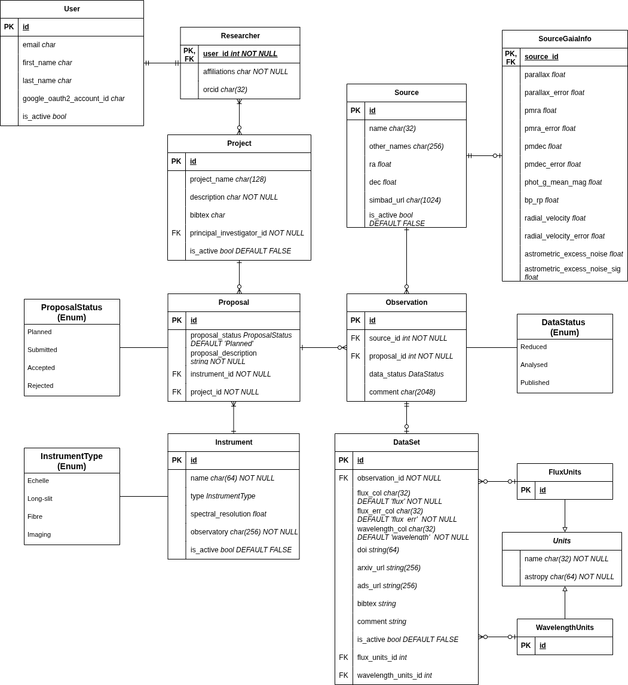
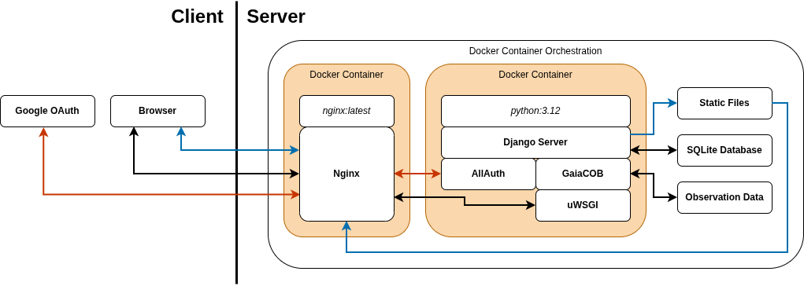
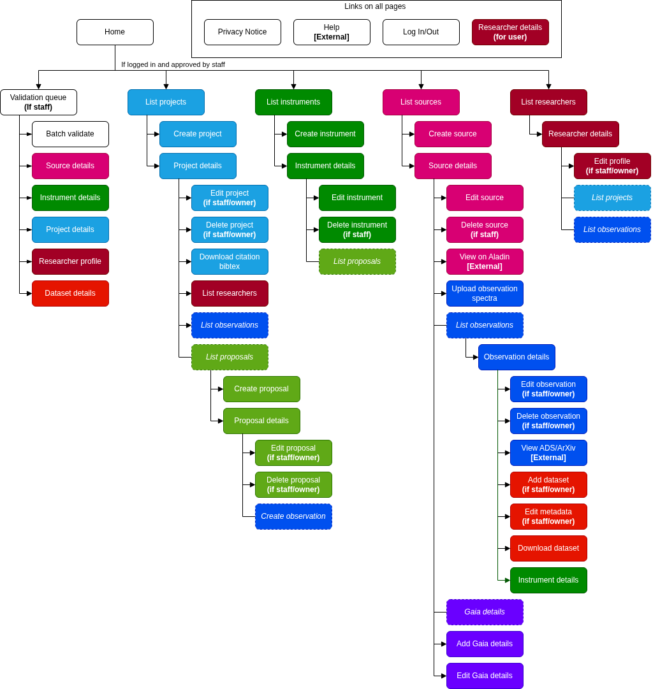

# Architecture

Architecture files are created in [Draw.io](https://www.drawio.com/). 
The `.png` files also contain the Draw.io diagrams; open them in it to edit.  

## Database

## Web Stack

## Sitemap

